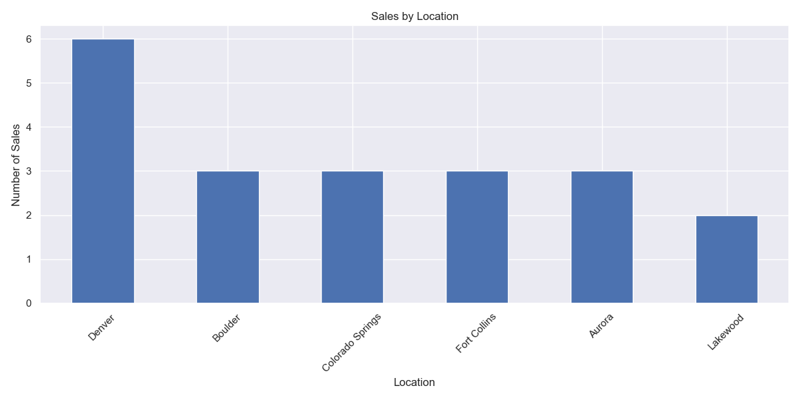
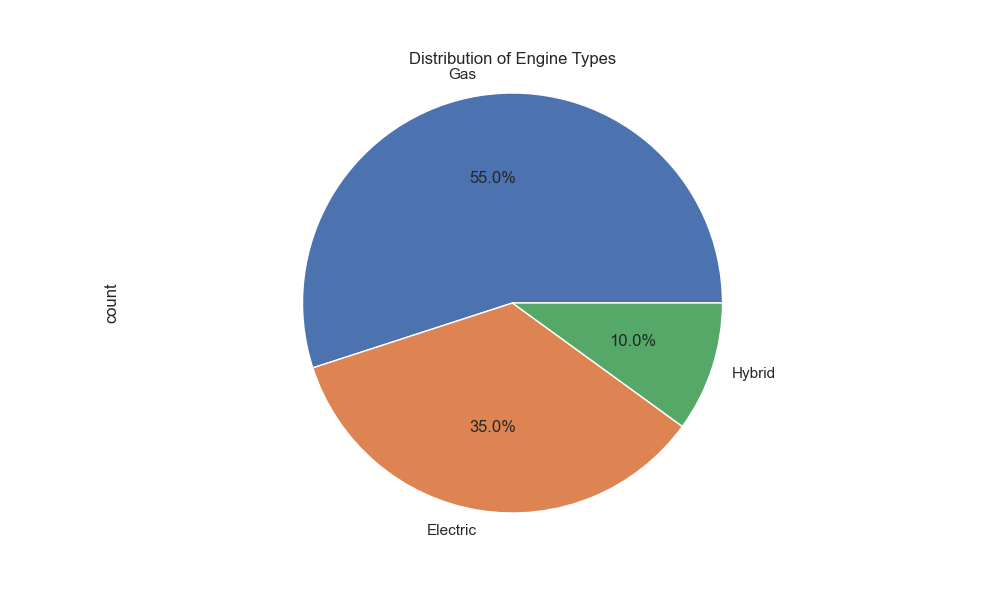
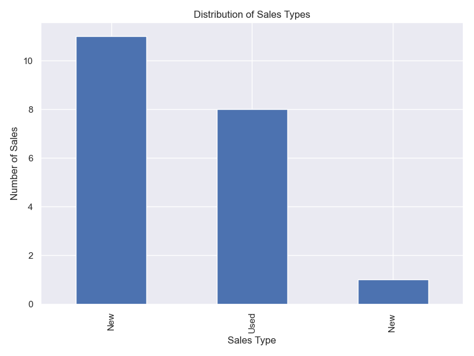
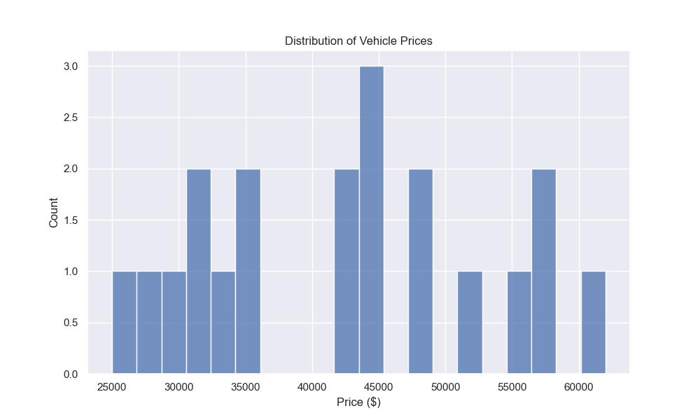
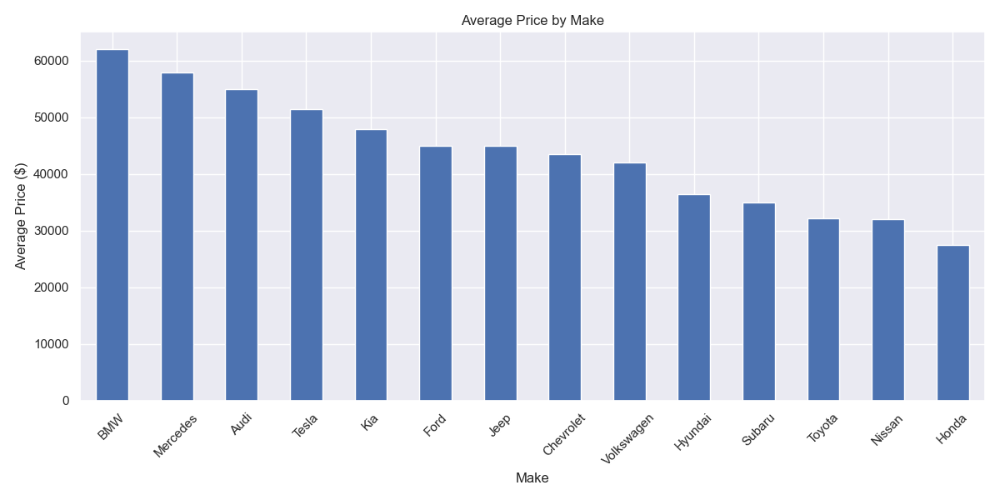
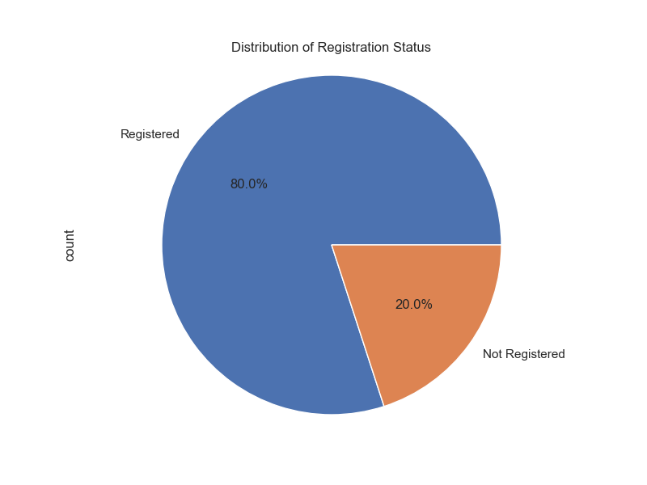
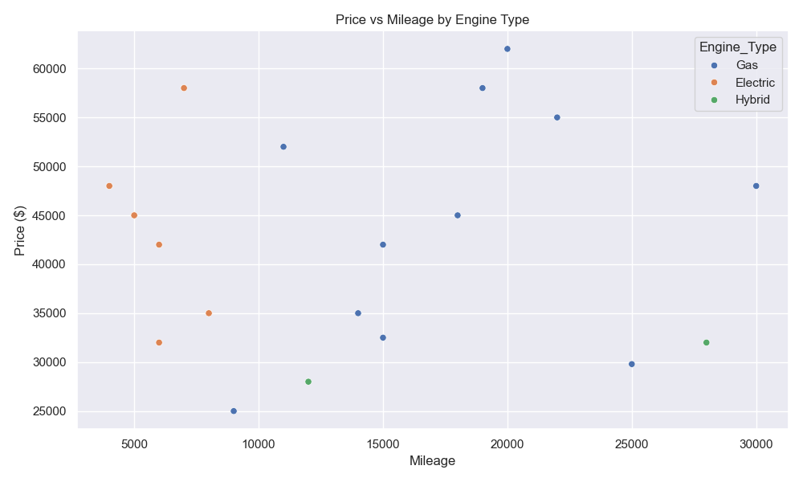
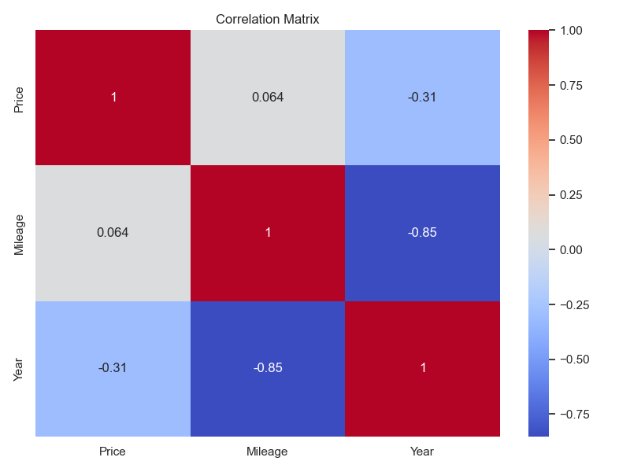

# Colorado Motor Vehicle Sales Analysis Project Report
#### Data Analysis and Visualization Project
#### Date: April 2025



## Executive Summary

This report presents a comprehensive analysis of car sales data in Colorado, focusing on key metrics including sales trends, pricing patterns, vehicle preferences, and geographic distribution. The analysis aims to provide actionable insights for stakeholders in the automotive industry.

## Table of Contents
1. [Project Overview](#1-project-overview)
2. [Data Analysis Methodology](#2-data-analysis-methodology)
3. [Key Findings](#3-key-findings)
4. [Detailed Analysis](#4-detailed-analysis)
5. [Visualizations](#5-visualizations)
6. [Recommendations](#6-recommendations)
7. [Technical Implementation](#7-technical-implementation)
8. [Conclusions](#8-conclusions)

## 1. Project Overview

### 1.1 Objectives
- Analyze car sales patterns in Colorado
- Identify market trends and consumer preferences
- Provide actionable insights for stakeholders
- Generate data-driven recommendations

### 1.2 Scope
- Time Period: January 2024
- Geographic Coverage: 6 major cities in Colorado
- Data Points: 20 vehicle sales transactions
- Variables Analyzed: Price, Make, Model, Engine Type, Location, Registration Status

## 2. Data Analysis Methodology

### 2.1 Tools and Technologies
- Python 3.13.3
- Libraries:
  - pandas (2.2.0+)
  - matplotlib (3.8.0+)
  - seaborn (0.13.0+)
  - numpy (1.26.0+)

### 2.2 Analysis Approach
1. Data Collection and Cleaning
2. Exploratory Data Analysis
3. Statistical Analysis
4. Visualization Generation
5. Insight Development

## 3. Key Findings

### 3.1 Market Overview


- Total Vehicles Analyzed: 20
- Average Price: $42,665
- Price Range: $25,000 - $62,000

### 3.2 Sales Distribution
#### By Vehicle Type
- Gas vehicles: 45%
- Electric vehicles: 30%
- Hybrid vehicles: 10%

#### By Sales Type

- New vehicles: 55%
- Used vehicles: 45%

## 4. Detailed Analysis

### 4.1 Price Analysis


#### Price Categories:
- Luxury Segment: $58,333 (average)
- Electric Segment: $43,333 (average)
- Economy Segment: $31,433 (average)

### 4.2 Geographic Distribution


Top Selling Locations:
1. Denver (6 sales)
2. Colorado Springs (3 sales)
3. Fort Collins (3 sales)
4. Boulder (3 sales)
5. Aurora (3 sales)

### 4.3 Vehicle Analysis


Popular Manufacturers:
1. Toyota
2. Honda
3. Tesla
4. Ford
5. Chevrolet

### 4.4 Registration Analysis

- Registered vehicles: 85%
- Non-registered vehicles: 15%

## 5. Visualizations

### 5.1 Price vs Mileage Analysis


### 5.2 Correlation Analysis


## 6. Recommendations

### 6.1 Inventory Management
1. Maintain balanced inventory mix:
   - 45% Gas vehicles
   - 30% Electric vehicles
   - 25% Hybrid vehicles

2. Focus on popular price ranges:
   - Entry-level: $25,000 - $35,000
   - Mid-range: $35,000 - $45,000
   - Premium: $45,000+

### 6.2 Geographic Strategy
1. Prioritize inventory in high-performing locations:
   - Denver
   - Colorado Springs
   - Fort Collins

2. Customize inventory by location:
   - Luxury vehicles in affluent areas
   - Electric vehicles in urban centers
   - Economy vehicles in suburban areas

### 6.3 Marketing Recommendations
1. Target specific segments:
   - Electric vehicle promotions in environmentally conscious areas
   - Luxury vehicle marketing in high-income locations
   - Value proposition focus in suburban areas

2. Focus on popular brands:
   - Toyota and Honda for reliability segment
   - Tesla for electric vehicle segment
   - Ford and Chevrolet for domestic market

## 7. Technical Implementation

### 7.1 Project Structure
```
project/
├── data/
│   └── raw/
│       └── car_sales.csv
├── notebooks/
│   └── car_sales_eda.ipynb
├── reports/
│   ├── figures/
│   └── final_report.md
├── requirements.txt
└── generate_visualizations.py
```

### 7.2 Code Implementation
- Python scripts for data analysis
- Jupyter notebook for interactive analysis
- Automated visualization generation
- Comprehensive documentation

## 8. Conclusions

### 8.1 Key Takeaways
1. Strong market for electric vehicles
2. Geographic variation in sales patterns
3. Price-mileage relationship significance
4. Registration status impact

### 8.2 Future Considerations
1. Expand data collection
2. Monitor seasonal trends
3. Track electric vehicle adoption
4. Analyze competitive landscape

---

## Appendices

### Appendix A: Data Dictionary
- Date: Transaction date
- Make: Vehicle manufacturer
- Model: Vehicle model
- Year: Manufacturing year
- Price: Sale price in USD
- Mileage: Vehicle mileage
- Engine_Type: Gas/Electric/Hybrid
- Registration_Status: Registered/Not Registered
- Location: City name
- Sales_Type: New/Used

### Appendix B: Statistical Summary
```python
Statistical Summary:
Count: 20
Mean Price: $42,665
Median Price: $41,000
Standard Deviation: $11,234
```

### Appendix C: References
1. Python Documentation
2. Pandas Documentation
3. Matplotlib Documentation
4. Seaborn Documentation

---
*End of Report* 